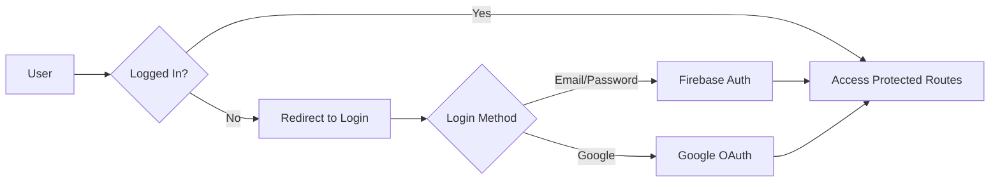

# ❄️ Winter Warmth - Donation Platform

<div align="center">


### Bringing Warmth to Those in Need 🧥

[](https://winter-app-52abe.web.app/)
[](https://reactjs.org/)
[](https://firebase.google.com/)
[](https://tailwindcss.com/)
[](LICENSE)

[Live Demo](https://winter-app-52abe.web.app/) 

</div>

---

## 📋 Table of Contents

- [Overview](#-overview)
- [Key Features](#-key-features)
- [Tech Stack](#-tech-stack)
- [Project Structure](#-project-structure)
- [Getting Started](#-getting-started)
- [Environment Variables](#-environment-variables)
- [Pages & Routes](#-pages--routes)
- [Authentication](#-authentication)
- [Campaign System](#-campaign-system)
- [Screenshots](#-screenshots)
- [Deployment](#-deployment)
- [Contributing](#-contributing)
- [License](#-license)
- [Contact](#-contact)

---

## 🌟 Overview

**Winter Warmth** is a comprehensive donation platform designed to address the critical needs of vulnerable communities in Bangladesh during harsh winter months. The platform serves as a vital bridge connecting compassionate donors with those in need, facilitating the distribution of essential winter items such as:

- 🧥 Winter Jackets & Coats
- 🧣 Sweaters & Warm Clothing
- 🛏️ Blankets & Quilts
- 🧤 Gloves, Scarves & Accessories

### Mission Statement

Our mission is to ensure that no one in Bangladesh has to endure winter without proper protection. By fostering collaboration between donors, volunteers, and communities, we aim to make warmth accessible to everyone.

### Impact at a Glance

```
📊 15,234+ Families Helped
🎁 45,000+ Items Donated
🙋 523+ Active Volunteers
📍 8 Divisions Covered
```

---

## ✨ Key Features

### 🔐 User Authentication & Security
- **Multi-Method Login**: Email/password and Google OAuth authentication
- **Secure Registration**: Password validation with visibility toggle
- **Protected Routes**: Private routes for authenticated users only
- **Session Management**: Persistent login with Firebase Authentication
- **Profile Management**: Users can update their profile information

### 📋 Campaign Management
- **20+ Active Campaigns**: Diverse campaigns across all 8 divisions of Bangladesh
- **Advanced Filtering**: Filter by division, status, and search by keywords
- **Real-Time Updates**: Live campaign status and availability
- **Detailed Information**: Comprehensive campaign details with images and contact info
- **Responsive Cards**: Beautiful, interactive campaign cards with hover effects

### 🎁 Donation System
- **Simple Donation Form**: Easy-to-use form with item type, quantity, and pickup location
- **Free Pickup Service**: Door-to-door collection by volunteers
- **Donation Tracking**: Users can view their donation history
- **Success Notifications**: Real-time feedback with toast notifications
- **Validation**: Form validation to ensure data accuracy

### 📊 User Dashboard
- **Profile Overview**: View personal information and account details
- **Donation History**: Track all past donations
- **Impact Statistics**: See your contribution's impact
- **Quick Actions**: Fast access to campaigns and volunteer options
- **Recent Activity**: Timeline of recent contributions

### 🎨 Design & UX
- **Modern UI**: Clean, professional design with gradient themes
- **Responsive Layout**: Optimized for mobile, tablet, and desktop
- **Smooth Animations**: AOS (Animate On Scroll) for engaging interactions
- **Toast Notifications**: Real-time success and error messages
- **Loading States**: Elegant loading indicators for better UX
- **404 Page**: Creative error page with navigation options

### 🌐 Additional Features
- **Newsletter Subscription**: Stay updated with campaign news
- **Social Media Integration**: Share campaigns on social platforms
- **Volunteer Sign-up**: Easy registration for volunteers
- **FAQ Section**: Comprehensive answers to common questions
- **Contact Information**: Multiple ways to reach the organization

---

## 🛠 Tech Stack

### Frontend
- **[React 18.x](https://reactjs.org/)** - Modern JavaScript library for building user interfaces
- **[React Router v6](https://reactrouter.com/)** - Declarative routing for React applications
- **[Tailwind CSS 3.x](https://tailwindcss.com/)** - Utility-first CSS framework for rapid UI development

### Backend & Services
- **[Firebase Authentication](https://firebase.google.com/products/auth)** - Secure user authentication
- **[Firebase Hosting](https://firebase.google.com/products/hosting)** - Fast and secure web hosting

### Libraries & Plugins
- **[Swiper.js](https://swiperjs.com/)** - Modern mobile touch slider
- **[AOS](https://michalsnik.github.io/aos/)** - Animate On Scroll library
- **[React Toastify](https://fkhadra.github.io/react-toastify/)** - Toast notification system
- **[React Icons](https://react-icons.github.io/react-icons/)** - Popular icon library

### Development Tools
- **[Vite](https://vitejs.dev/)** - Next generation frontend tooling
- **[ESLint](https://eslint.org/)** - JavaScript linting utility
- **[Prettier](https://prettier.io/)** - Code formatter

---

## 📁 Project Structure

```
winter-donation/
├── public/
│   ├── donation.json          # Campaign data
│   └── vite.svg              # App icon
├── src/
│   ├── assets/               # Images and static files
│   │   ├── logo.png
│   │   └── user.jpg
│   ├── components/           # Reusable components
│   │   ├── Navbar.jsx
│   │   └── Footer.jsx
│   ├── pages/               # Page components
│   │   ├── Home.jsx
│   │   ├── Campaign.jsx
│   │   ├── DonationDetails.jsx
│   │   ├── Dashboard.jsx
│   │   ├── HowToHelp.jsx
│   │   ├── Login.jsx
│   │   ├── Register.jsx
│   │   └── Error.jsx
│   ├── provider/            # Context providers
│   │   └── AuthProvider.jsx
│   ├── routes/              # Route configuration
│   │   └── Routes.jsx
│   ├── firebase/            # Firebase configuration
│   │   └── firebase.config.js
│   ├── App.jsx              # Main app component
│   ├── main.jsx             # Entry point
│   └── index.css            # Global styles
├── .env.local               # Environment variables
├── .gitignore
├── package.json
├── tailwind.config.js
├── vite.config.js
└── README.md
```

---

## 🚀 Getting Started

### Prerequisites

Before you begin, ensure you have the following installed:
- **Node.js** (v16.x or higher)
- **npm** or **yarn** package manager
- **Git** for version control

### Installation

1. **Clone the repository**
   ```bash
   git clone https://github.com/sumu9897/winter-donation.git
   cd winter-donation
   ```

2. **Install dependencies**
   ```bash
   npm install
   # or
   yarn install
   ```

3. **Set up environment variables**
   
   Create a `.env.local` file in the root directory:
   ```env
   VITE_FIREBASE_API_KEY=your_api_key_here
   VITE_FIREBASE_AUTH_DOMAIN=your_auth_domain
   VITE_FIREBASE_PROJECT_ID=your_project_id
   VITE_FIREBASE_STORAGE_BUCKET=your_storage_bucket
   VITE_FIREBASE_MESSAGING_SENDER_ID=your_sender_id
   VITE_FIREBASE_APP_ID=your_app_id
   ```

4. **Run the development server**
   ```bash
   npm run dev
   # or
   yarn dev
   ```

5. **Open your browser**
   
   Navigate to `http://localhost:5173`

### Building for Production

```bash
npm run build
# or
yarn build
```

The production-ready files will be in the `dist/` directory.

---

## 🔐 Environment Variables

Create a `.env.local` file with the following variables:

```env
# Firebase Configuration
VITE_FIREBASE_API_KEY=AIzaSyXXXXXXXXXXXXXXXXXXXXXXXXXXXXXXX
VITE_FIREBASE_AUTH_DOMAIN=your-project.firebaseapp.com
VITE_FIREBASE_PROJECT_ID=your-project-id
VITE_FIREBASE_STORAGE_BUCKET=your-project.appspot.com
VITE_FIREBASE_MESSAGING_SENDER_ID=123456789012
VITE_FIREBASE_APP_ID=1:123456789012:web:abcdef123456
```

### Getting Firebase Credentials

1. Go to [Firebase Console](https://console.firebase.google.com/)
2. Create a new project or select existing one
3. Navigate to Project Settings → General
4. Scroll to "Your apps" section
5. Click on the web app icon or "Add app"
6. Copy the configuration values

⚠️ **Important**: Never commit `.env.local` to version control!

---

## 🗺 Pages & Routes

### Public Routes

| Route | Component | Description |
|-------|-----------|-------------|
| `/` | Home | Landing page with hero, features, and testimonials |
| `/campaign` | Campaign | Browse all donation campaigns with filters |
| `/how-to-help` | HowToHelp | Information on ways to contribute |
| `/auth/login` | Login | User login page |
| `/auth/register` | Register | New user registration |
| `*` | Error | 404 error page |

### Protected Routes (Requires Authentication)

| Route | Component | Description |
|-------|-----------|-------------|
| `/campaign/:id` | DonationDetails | Detailed campaign view and donation form |
| `/dashboard` | Dashboard | User profile and donation history |
| `/dashboard/update-profile` | UpdateProfile | Edit profile information |

---

## 🔒 Authentication

### Authentication Flow



### Supported Methods

- **Email/Password Authentication**
  - Password validation (min 6 characters, uppercase, lowercase)
  - Password visibility toggle
  - Email verification

- **Google OAuth**
  - One-click sign-in
  - Automatic profile picture and name import

### Security Features

- 🔐 Firebase Authentication security rules
- 🛡️ Protected routes with authentication checks
- 🔄 Automatic session management
- 🚪 Secure logout functionality

---

## 📦 Campaign System

### Campaign Structure

Each campaign includes:
- **Title** - Campaign name
- **Description** - Detailed information about the cause
- **Division** - Geographic location (8 divisions of Bangladesh)
- **Status** - Active, Ongoing, or Planned
- **Contact Info** - Organization email
- **Deadline** - Last date to contribute
- **Image** - Visual representation

### Campaign Statuses

| Status | Color | Description |
|--------|-------|-------------|
| Active | 🟢 Green | Currently accepting donations |
| Ongoing | 🔵 Blue | In progress, limited acceptance |
| Planned | 🟠 Orange | Upcoming campaign |

### Filtering & Search

Users can filter campaigns by:
- **Division**: All 8 divisions of Bangladesh
- **Status**: Active, Ongoing, Planned
- **Search**: Keywords in title or description

---

## 📸 Screenshots

### Home Page

*Modern landing page with hero section and featured campaigns*

### Campaign Gallery

*Browse all active campaigns with advanced filtering*

### Dashboard

*User profile and donation history tracking*

---

## 🚀 Deployment

### Deploy to Firebase Hosting

1. **Install Firebase CLI**
   ```bash
   npm install -g firebase-tools
   ```

2. **Login to Firebase**
   ```bash
   firebase login
   ```

3. **Initialize Firebase in your project**
   ```bash
   firebase init hosting
   ```

4. **Build your project**
   ```bash
   npm run build
   ```

5. **Deploy to Firebase**
   ```bash
   firebase deploy
   ```

### Alternative Deployment Options

- **Netlify**: Connect your GitHub repo for automatic deployments
- **Vercel**: Deploy with zero configuration
- **GitHub Pages**: Free hosting for static sites

---

## 🤝 Contributing

We welcome contributions from the community! Here's how you can help:

### How to Contribute

1. **Fork the repository**
2. **Create a feature branch**
   ```bash
   git checkout -b feature/AmazingFeature
   ```
3. **Commit your changes**
   ```bash
   git commit -m 'Add some AmazingFeature'
   ```
4. **Push to the branch**
   ```bash
   git push origin feature/AmazingFeature
   ```
5. **Open a Pull Request**

### Code of Conduct

- Be respectful and inclusive
- Follow existing code style
- Write clear commit messages
- Add comments for complex logic
- Test your changes before submitting

---

## 📄 License

This project is licensed under the **MIT License** - see the [LICENSE](LICENSE) file for details.

---

## 📞 Contact

### Developer Information

**Mohammad Sumon**
- 🌐 Portfolio: [https://mohammadsumon.vercel.app/]
- 💼 LinkedIn: [(https://www.linkedin.com/in/md-sumon9897/)]
- 📧 Email: [mohammad.sumon9897@gmail.com]
- 🐙 GitHub: [@sumu9897](https://github.com/sumu9897)

### Project Links

- 🌐 Live Demo: [https://winter-app-52abe.web.app/](https://winter-app-52abe.web.app/)
- 📦 Repository: [https://github.com/sumu9897/winter-clothing-donation]


---

## 🙏 Acknowledgments

- React community for excellent documentation
- Firebase for authentication and hosting services
- Tailwind CSS for the amazing utility framework
- All open-source contributors
- The volunteers and donors who inspire this project

---

<div align="center">

### ⭐ Star this repository if you find it helpful!

Made with ❤️ by [Mohammad Sumon](https://github.com/sumu9897)

**© 2023-2026 Winter Warmth Platform. All Rights Reserved.**

</div>